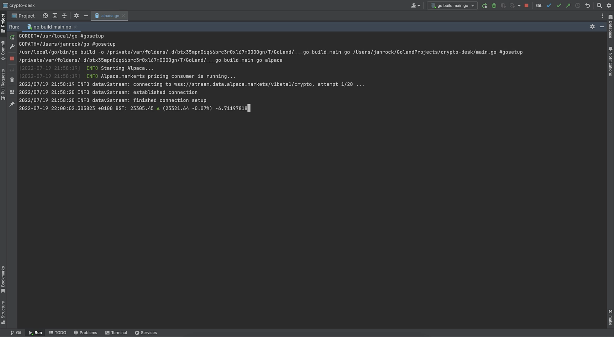

# Crypto-Desk

### Description:
Crypto strategies for various crypto exchanges in Golang.
- starting with Alpaca.Markets and Golang TA indicators

### Screen #1
- tradebook, sound based on a side and intensity on size of a trade)

[](crypto-desk.mp4)
```shell
go run main.go alpacatb
./<app> alpacatb
```

### Screen #2
- pricing, interval based aggreated prices are stored into a DB with pool of indicators
- inerface for real-time price change

```shell
go run main.go alpacapr
./<app> alpacapr
```

### Tests:
```shell
# env. variables test
go test -v ./cmd -run TestVarAlpaca 
```